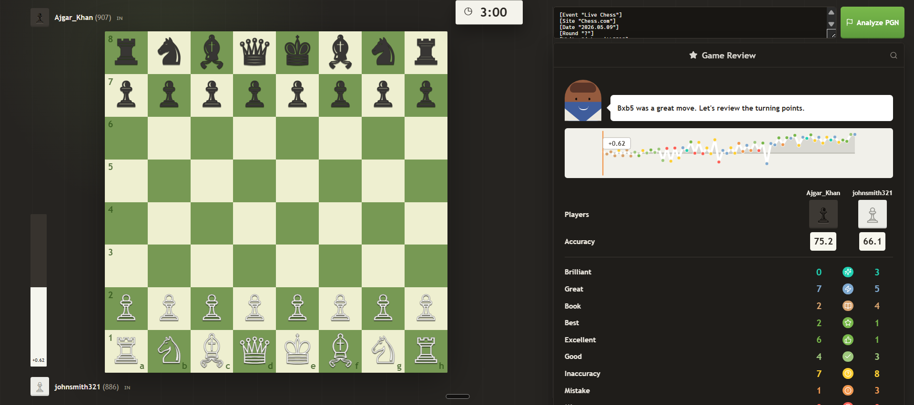

# Chess Review Engine

A local chess game review app with a Python/FastAPI analyzer and a React frontend.

## Run

```powershell
.\.venv\Scripts\python -m uvicorn backend.main:app --host 127.0.0.1 --port 8000
```

In another terminal:

```powershell
cd frontend
npm run dev -- --port 5173
```

Open http://127.0.0.1:5173.

## What It Does

- Parses pasted PGN and loads the included sample PGN.
- Navigates the game with on-screen controls and keyboard arrow keys.
- Shows a chess.com-style review panel with eval graph, player accuracy, move-quality counts, game ratings, phase verdicts, and a coach insight.
- Lets you click pieces on the board to make a sandbox move; the backend scores the move and displays the move-quality badge on the destination square.

The analysis engine uses `python-chess` for legal move generation and PGN handling, plus a deterministic local evaluation/search layer for fast move classification.
